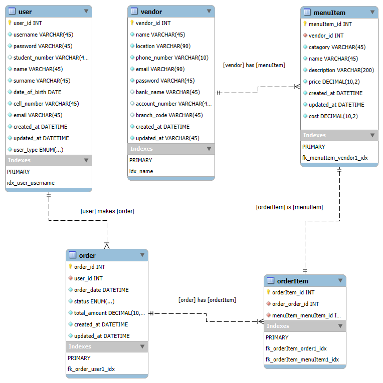

# Order Management System for Campus Restaurants

This system is designed to supplement the current in-person ordering process used by most campus restaurants. It offers a new avenue for generating orders that might have been lost in the past. Furthermore, this online ordering system provides restaurants with valuable insights into the data generated by orders, analytics,  allowing them to make more informed decisions and potentially increase profits.

This project will use TENZ as a case study. The sample data used will be based on TENZ.

---

## Wireframes 

Below is the wireframes designed for the web application. They give the general design of the screens and also show the flows between them. These wireframes were used to develop the web pages in HTML and using CSS and Bootstrap libraries to format the visual front-end of the web application.

## SQL Database Structure

MySQL workbench was used to create the tables of the Entity Relationship Diagram (ERD). This software application was used to create the tables because we were exposed to it in BID320 (Informasion Systems Design). These tables were then converted to SQLite. The tables created was **users**, **vendors**, **menuItems**, **orders** and **orderItems**. 

The structure of the database tables is illustrated in the **Entity-Relationship Diagram (ERD)** below. Also included is the relationships between the tables. 

**

Data has been added to the database to ensure the application runs smoothly during demonstrations. Some of the data is **"dummy" data** to respect privacy, while other data, such as the menu items, is **real data** collected from the TENZ menu.

---

## Sample Data Included

The database has been populated with the following sample data for demonstration purposes:

* **2 Users:** One customer and one admin.
* **1 Vendor (Restaurant):** TENZ.
* **12 Menu Items:** A shortened version of the TENZ menu.
* **2 Orders:** Two historical orders to show past data.
* **Order Items:** Data detailing the specific items included in each of the two historical orders.

---

## User Roles and Permissions

The application supports three user types, each with different permissions:

1.  **Customer User**
2.  **Admin User**
3.  **Vendor User** (TENZ manager)

A user will be able to register for the platform. The admin user, a University employee, will a administrator of the website. They will have the power to make changes to the website and have the responsibility of adding a new vendor to the website after they have been approved by the University. A **Vendor** will have access to all vendor-specific screens and functionalities, including:
* Adding new **menu items**.
* **Accepting and viewing** incoming orders.
* An **analytics suite** to base business decisions on.

---

## Project Current Stage (Front-End Focus)

For the current stage of the project, **not all functionalities are fully operational**. This is primarily due to the back-end of the website not yet being connected.

The current **front-end** demonstrates the logical flow of screens and processes. Because the back-end is not yet connected, most of the features will be shown. Therfore some of the elements are currently hardcoded to ensure that most of the functionality can be seen. 

---
